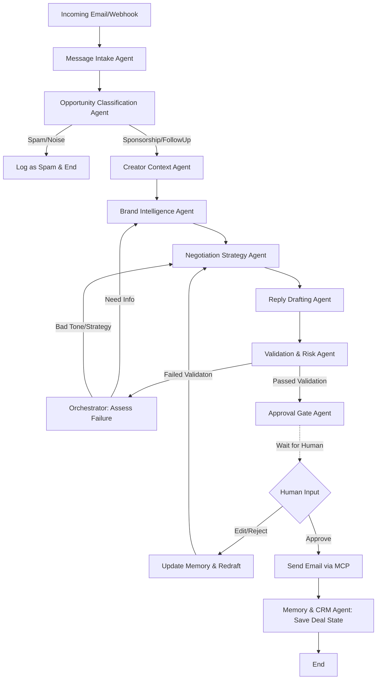

# Creator Sponsorship SaaS Multi-Agent Backend

This document outlines the architecture and implementation plan for the multi-agent backend that behaves like a creator finance team.

## 1. Architecture Overview

The system is built as a stateful, event-driven, multi-agent pipeline. It is not a simple linear conversational agent. It uses specialized agents orchestrating complex workflows with explicit human-in-the-loop steps.

**Stack:**
- **Orchestration:** LangGraph (State graph, persistence, looping, arbitrary Python execution)
- **Agent Framework:** CrewAI (for defining specialized agent roles, goals, and delegation where appropriate within LangGraph nodes)
- **Memory:** Mem0 (for entity-level persistent memory: brands, creator preferences, deal history)
- **Tools:** Model Context Protocol (MCP) servers (for isolated, standard execution of external tools)
- **Database:** Supabase (PostgreSQL) for transactional state, UI backend, and structured logs.
- **Observability:** Sentry MCP (error tracking). LangSmith (highly recommended for tracking multi-agent traces).

**Key Paradigms:**
- **Stateful Workflow:** The entire process from email receipt to final negotiation approval is modeled as a LangGraph state machine.
- **Checkpointers:** LangGraph's checkpointer saves the workflow state at every node. If validation fails or a human needs to approve, the graph pauses and resumes upon input.
- **Separation of Duties:** Each agent is a narrow LLM chain/Crew member with restricted prompts and specifically scoped tools.

---

## 2. Agent Map

| Agent Name | Role | Responsibilities | Key Inputs | Outputs |
| :--- | :--- | :--- | :--- | :--- |
| **Message Intake Agent** | Parser | Reads raw email/DM, extracts entities, detects sender, intent, urgency. | Raw message string | Structured JSON (Sender, Intent, Deal Stage) |
| **Opportunity Classification Agent** | Classifier | Decides if message is sponsorship, spam, fan mail, or follow-up. Assigns confidence. | Structured JSON | Classification Result, Next routing step |
| **Brand Intelligence Agent** | Researcher | Deep dive on brand. Competitors, recent news, reputation. | Brand Name, URL | Research Brief (citations, risks) |
| **Creator Context Agent** | Analyst | Retrieves creator pricing, blocked categories, tone preferences, past deals. | Creator ID, Brand | Creator Context Brief |
| **Negotiation Strategy Agent** | Strategist | Decides anchor price, counter-offer, boundaries based on research and context. | Research Brief, Creator Context | Negotiation Strategy JSON |
| **Reply Drafting Agent** | Copywriter | Drafts the human-like, non-robotic reply. Ensures creator control. | Strategy, Context | Email Draft String |
| **Memory & CRM Agent** | Data Manager | Interfaces with Mem0 and Supabase to read/write persistent state. | Graph State | CRM Update Confirmation |
| **Validation & Risk Agent** | Auditor | Checks draft against rules, tone, and facts. Rejects bad outputs. | Draft, Strategy, Context | Pass/Fail + Revision Notes |
| **Approval Gate Agent** | Human Interface| Pauses the graph. Formats for UI. Waits for creator approval. | Draft, Research | Human Signal (Approve/Reject/Edit) |
| **Orchestrator Agent** | Controller | LangGraph Supervisor. Routes to correct nodes based on state (e.g. loops back if Research fails). | Full State | Next Node State |

---

## 3. Tool Map (via MCP)

| Tool Category | MCP Server / API | Agents using this tool | Purpose |
| :--- | :--- | :--- | :--- |
| **Email** | Gmail / Resend MCP | Intake, Reply, Approval Gate | Reading incoming deals, sending approved drafts. |
| **Web Research** | Tavily MCP | Brand Intelligence | Fast factual lookups, news, sentiment. |
| **Web Scraping** | Firecrawl MCP | Brand Intelligence | Scraping brand websites, recent campaigns. |
| **Memory** | Mem0 / API | Creator Context, Memory & CRM | Storing/Retrieving past deals, creator boundaries. |
| **Database** | Postgres / Supabase MCP | Memory & CRM, Intake | Storing structured workflow state & UI dashboard data. |
| **Notifications** | Slack MCP | Approval Gate, Orchestrator | Notifying creator of a pending draft or urgent deal. |
| **Debugging** | Sentry MCP | Orchestrator | Logging system failures or API timeouts. |
| **Project Mgmt**| GitHub MCP | (DevOps/Admin) | Codebase tracking (less relevant for core runtime, good for dev). |

> [!TIP]
> By using MCP servers, each agent only gets the specific tools it needs (e.g., the Draft agent has NO access to email sending or web browsing).

---

## 4. Memory Schema

Memory is divided into two parts: **Working Memory** (LangGraph State) and **Persistent Memory** (Mem0 + Supabase).

### LangGraph State (Working Memory per Deal)
```python
class DealState(TypedDict):
    message_id: str
    raw_message: str
    sender_email: str
    brand_name: str
    classification: str # "sponsorship", "spam", "follow_up"
    confidence_score: float
    research_brief: dict
    creator_context: dict
    negotiation_strategy: dict
    current_draft: str
    validation_status: str # "pending", "passed", "failed"
    validation_notes: str
    human_approval: str # "approved", "edit_required", "rejected"
    errors: list[str]
```

### Mem0 Schema (Persistent Memory)
**Entity: Creator**
- `user_id`: "creator_123"
- `memory_text`: "Prefers casual, expert tone. Hates exclamation marks. Minimal sponsorship price is $2000. Will not work with gambling or crypto brands."
- `metadata`: `{"type": "preference", "category": "tone"}`

**Entity: Brand**
- `user_id`: "brand_nike"
- `memory_text`: "Paid on time last campaign. Usually negotiates down 15%. Strict about deliverables."
- `metadata`: `{"type": "deal_history", "sentiment": "positive"}`

---

## 5. Workflow Diagram



---

## 6. Folder Structure

A production-ready, highly modular folder structure.

```text
creator-finance-os/
├── agents/                     # CrewAI Agent Definitions
│   ├── __init__.py
│   ├── base_agent.py           # Shared agent configurations
│   ├── intake_agent.py         # Message Intake & Classification
│   ├── research_agent.py       # Brand Intelligence
│   ├── strategy_agent.py       # Creator Context & Negotiation
│   ├── draft_agent.py          # Drafting & Validation
│   └── crm_agent.py            # Memory & Storage
├── graph/                      # LangGraph Orchestration
│   ├── __init__.py
│   ├── state.py                # TypedDict for DealState
│   ├── nodes.py                # Functions bridging State <-> Agents
│   ├── edges.py                # Conditional routing logic
│   └── workflow.py             # LangGraph builder (StateGraph)
├── tools/                      # Custom Tools & MCP Client wrappers
│   ├── __init__.py
│   ├── mcp_client.py           # Universal MCP invoker
│   └── mem0_client.py          # Memory interface
├── api/                        # FastAPI Endpoints (UI backend)
│   ├── __init__.py
│   ├── routes.py               # Webhooks, Approval endpoints
│   └── dependencies.py         
├── config/                     # Settings and environment control
│   └── settings.py             # Pydantic BaseSettings
├── docker/                     # Deployment
│   ├── Dockerfile
│   └── docker-compose.yml
├── requirements.txt
└── main.py                     # Entrypoint (Starts API & workflow engine)
```

---

## 7. Implementation Order

To build this practically and securely without getting overwhelmed by the multi-agent complexity:

1. **Phase 1: Foundation & State**
   - Setup project structure, environment variables.
   - Define the `DealState` typed dictionary.
   - Create a skeleton LangGraph with dummy nodes that just pass hardcoded data.
2. **Phase 2: MCP Tool Integrations**
   - Setup the MCP client connections (Tavily, Firecrawl, Email, etc.).
   - Test MCP tools in isolation via simple Python scripts to ensure API keys and server connections work.
3. **Phase 3: The Research & Strategy Core (Read-Only)**
   - Implement Intake, Classification, Context, and Research Agents.
   - Connect these nodes in LangGraph.
   - Send test emails into the system and verify the `DealState` populates perfectly with accurate brand research and classification.
4. **Phase 4: Drafting & Validation**
   - Implement the Negotiation and Drafting agents.
   - Implement the Validation agent. Build the feedback loop in LangGraph so the graph iterates if the draft is robotic.
5. **Phase 5: Persistent Memory & Approval Gate (The Hard Part)**
   - Integrate Mem0. Ensure context is actually pulling accurate past data.
   - Implement the human-in-the-loop interruption in LangGraph.
   - Build a simple FastAPI route to "Approve" a paused graph and resume execution.
6. **Phase 6: Productionization**
   - Connect the email sending tool to the final node (only executing after approval).
   - Hook up Supabase to log entire traces of the deals.
   - Dockerize and deploy.

## User Review Required

> [!IMPORTANT]
> **Before proceeding to code generation, please answer/confirm the following:**
> 1. Does this architecture map perfectly to your vision of the product?
> 2. Are you comfortable using FastAPI to host the LangGraph workflow + provide the human "Approval Gate" webhook endpoints?
> 3. Should we establish the base repository as a Python (Poetry/requirements.txt) project?
> 4. Once approved, I will begin implementing **Phase 1 and Phase 2**. No external emails will be sent out automatically; everything will halt at the Approval Gate module.

Are you ready to approve this plan, or would you like to tweak the structure first?
